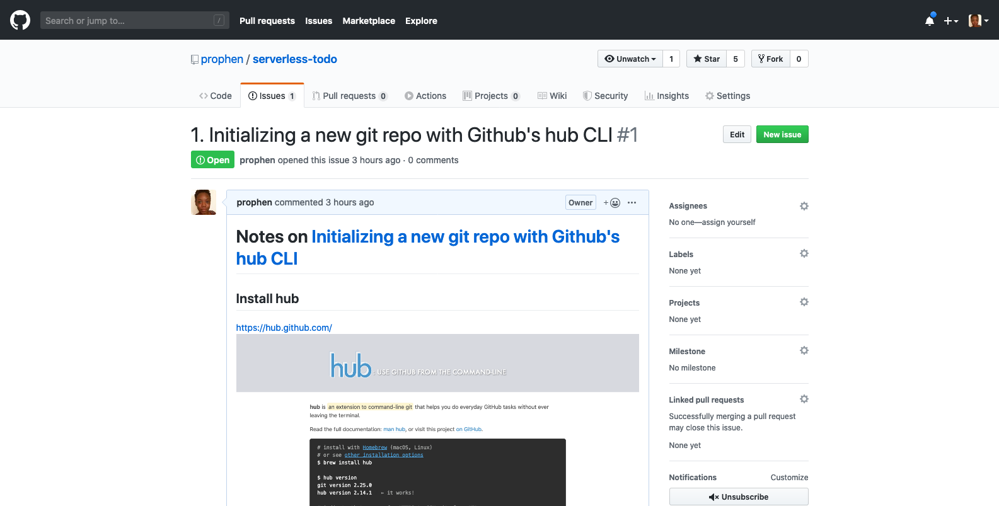

# 100 Days of Code - Day 1

It's day one and so far here's what I've done with code:

- [Took notes](https://github.com/prophen/serverless-todo/issues/1) on the egghead.io course I finished yesterday.

- Set up this repo using [GitHub hub](https://hub.github.com).
- Viewed my learning module and passed the quiz for this week in my iOS course. The topic is control flow.
   - [Swift Docs on Control Flow](https://docs.swift.org/swift-book/LanguageGuide/ControlFlow.html)
