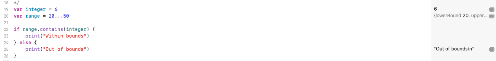
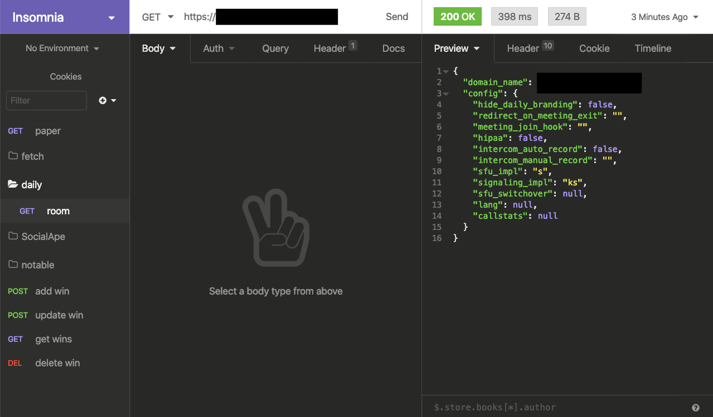

# 100 Days of Code - Days 6 and 7

I didn't touch a code editor yesterday (day 6) but I did some work engaging with my community on Twitter.

I'm letting it be known that I want to work as a developer in a community or advocate role. Engaging with the community and writing documentation are skills I am working on demonstrating and creating a body of work around.

Worked on a few exercises for my iOS class.

Digging into daily.co api

*****

Links to work:
- https://github.com/prophen/daily-js

Resources I used today:

Swift
- https://developer.apple.com/documentation/swift/range#see-also
- https://developer.apple.com/documentation/swift/closedrange

Daily.co API
- https://docs.daily.co/reference#introduction

Social posts:
- https://twitter.com/dev_nikema/status/1231322299669762049?s=20
- https://twitter.com/dev_nikema/status/1231422919697321984?s=20

****

 

