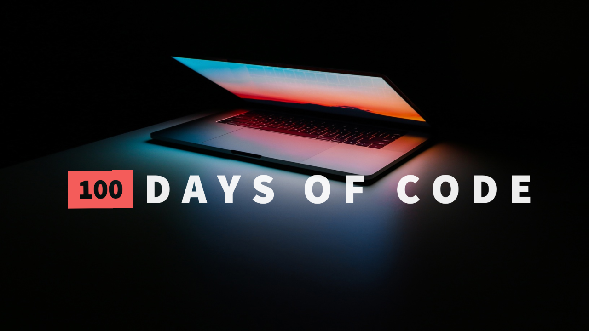

# Nikema's 100 Days of Code Challenge

I've attempted this several times and I have yet to get to the end of the challenge. I'm ready now and I wont give up until I reach day 100.

My focus is on documentation and learning git. I only had my first successful rebase yesterday (Feb. 15, 2020). I know git is powerful and I want to learn how to use it well.

****

## Table of Contents
- [Day 1](./Day-1.md)
- [Day 2](./Day-2.md)
- [Day 3](./Day-3.md)
- [Day 4](./Day-4.md)
